<!-- Header -->

  

  

 

<!-- Typing animation -->

  

 

---

## 🙋‍♂️ About Me

I'm **Nisal**, a 22-year-old Electronics & IoT Engineer from 🇱🇰 **Sri Lanka** — studying **Electronic & Embedded Systems** and self-taught in backend/API development.

My core focus is simple: **make hardware and software talk to each other**. I design circuits, build IoT systems, and write the APIs that connect them to the digital world. Whether it's a fire alarm that pings a server or a GPS tracker with a live web dashboard — I build the full chain, from the sensor to the screen.

- 🔭 Currently building: **Flyback INSIGHTS** — a full-stack editorial blog platform
- 🌱 Currently studying: **Python algorithms** + advanced embedded systems
- 💼 Open to: **Freelance** — IoT systems, embedded projects, hardware-connected APIs
- ⚡ Fun fact: I went from editing videos to designing PCBs — creativity takes many forms

 

---

## 🎯 Core Expertise

> These are what I do. Everything else is a supporting skill.

 

### ⚡ Electronics & Embedded Systems

| Technology | Level |
|------------|-------|
| IoT System Design | 🔴 Expert |
| Arduino | 🔴 Expert |
| C / C++ (Embedded) | 🟠 Proficient |
| Raspberry Pi | 🟠 Proficient |
| PCB Design — Altium | 🟡 Intermediate |
| Circuit Simulation — Proteus | 🟡 Intermediate |
| 3D Design — SolidWorks | 🟡 Intermediate |

  
  
  
  
  
  
  

 

### 🔌 API Development *(Hardware–Software Bridge)*

| Technology | Level |
|------------|-------|
| Node.js / Express | 🟠 Proficient |
| JavaScript | 🟠 Proficient |
| MongoDB | 🟠 Proficient |
| REST API Design | 🟠 Proficient |
| Supabase | 🟡 Intermediate |
| TypeScript | 🟡 Intermediate |

  
  
  
  
  
  

 

---

## 🧰 Supporting Skills

> Tools I use to build complete, polished projects — not my headline, but part of the toolkit.

 

### 🌐 Frontend *(for full project delivery)*

  
  
  

### 📚 Currently Learning

  
  

### 🎨 Creative *(for fun)*

  
  

 

---

## 🚀 Featured Projects

<table>
  <tr>
    <td width="50%">
      <h3>🗺️ Arduino MERN GPS Tracker</h3>
      
Real-time GPS tracking — Arduino hardware feeding live location data through a Node.js API to a MERN web dashboard. Hardware and software as one system.

      
  

      <a href="https://github.com/kbvideo6/arduino-mern-gps-tracker">View Project →</a>
    </td>
    <td width="50%">
      <h3>🔥 AIoT Fire Alarm System</h3>
      
An AI-powered IoT fire detection system — smart embedded hardware with real-time alerting over the network. Sensors to server, end to end.

      
 

      <a href="https://github.com/kbvideo6/AIOT-Fire-Alarm-Systerm-SLIOT">View Project →</a>
    </td>
  </tr>
  <tr>
    <td width="50%">
      <h3>🛡️ CrossPlatform Content Filter</h3>
      
UltraGuard — a cross-platform digital wellbeing system with DNS filtering, always-on VPN, and device policy management for Windows & Android.

      

      <a href="https://github.com/kbvideo6/CrossPlatform-Content-Filter">View Project →</a>
    </td>
    <td width="50%">
      <h3>📰 Flyback INSIGHTS — Full-Stack Blog</h3>
      
A dark-themed tech editorial platform — Node.js API backend, Supabase database, React frontend, and a full Storybook component library.

      
 

      <a href="https://github.com/kbvideo6/Flyback-INSIGHTS-A-FULL-STACK-BLOG">View Project →</a>
    </td>
  </tr>
</table>

 

---

## 📊 GitHub Stats

  
  

  

 

---

## 🏆 GitHub Trophies

  

 

---

## 💼 Open to Freelance

I'm available for freelance projects in my areas of expertise:

- 🔌 **IoT systems** — sensor networks, embedded hardware, real-time data
- ⚡ **Embedded projects** — Arduino, Raspberry Pi, PCB design
- 🔗 **Hardware-connected APIs** — Node.js backends that talk to your hardware
- 🖥️ **Full project delivery** — from circuit to dashboard

Feel free to reach out via [**Fiverr**](https://www.fiverr.com/kbvideo6) or check out my [**Portfolio**](https://artstudio-portfolio.netlify.app/).

 

---

## 📈 Contribution Graph

  

 

<!-- Footer -->

  

  <i>⭐ If you find my work interesting, consider giving a star — it means a lot! ⭐</i>

